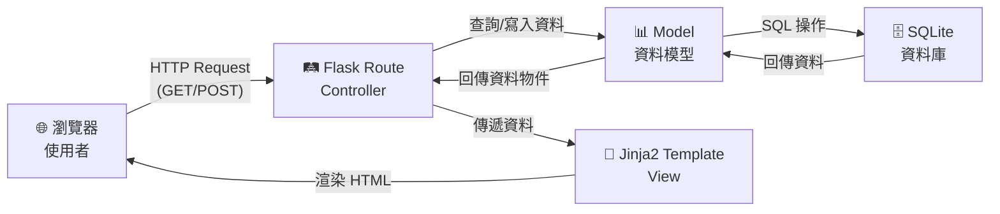
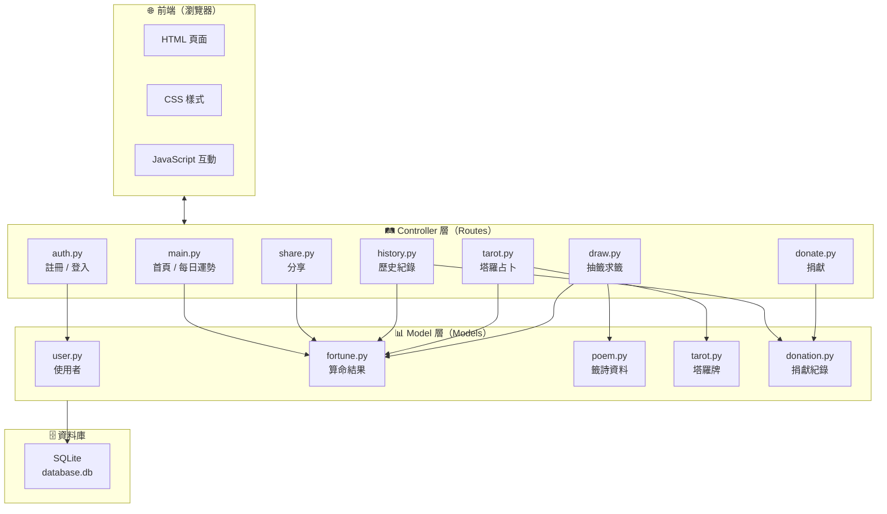
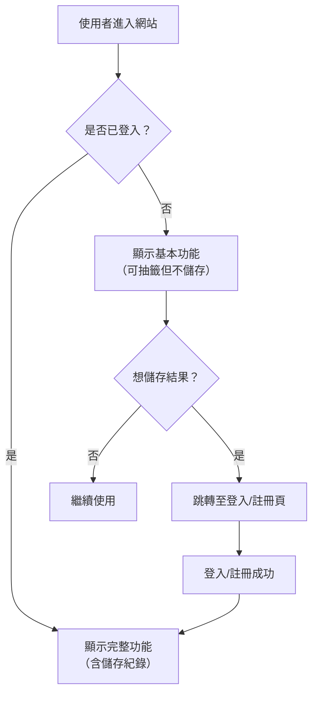

# 系統架構設計 — 線上算命系統

> **文件版本：** v1.0
> **建立日期：** 2026-04-09
> **對應文件：** [PRD.md](./PRD.md)

---

## 1. 技術架構說明

### 1.1 選用技術與原因

| 技術 | 角色 | 選用原因 |
|------|------|---------|
| **Python 3** | 程式語言 | 語法簡潔易學，適合初學者快速上手 |
| **Flask** | 後端框架 | 輕量級微框架，學習曲線低，適合中小型專案 |
| **Jinja2** | 模板引擎 | Flask 內建支援，可直接在 HTML 中嵌入 Python 邏輯 |
| **SQLite** | 資料庫 | 免安裝、零設定，單一檔案即可運作，適合開發與學習 |
| **HTML + CSS + JS** | 前端 | 標準網頁技術，搭配 Jinja2 進行伺服器端渲染（SSR） |

### 1.2 Flask MVC 模式說明

本專案採用 **MVC（Model-View-Controller）** 架構模式，將程式邏輯清楚分層：

```
┌─────────────────────────────────────────────────────────┐
│                      瀏覽器（Browser）                    │
│                   使用者透過瀏覽器操作系統                  │
└──────────────┬──────────────────────▲────────────────────┘
               │ HTTP Request         │ HTTP Response (HTML)
               ▼                      │
┌──────────────────────────────────────────────────────────┐
│                  Controller（控制器）                      │
│               app/routes/*.py                            │
│                                                          │
│  • 接收使用者的 HTTP 請求（GET / POST）                    │
│  • 呼叫 Model 存取資料                                    │
│  • 決定要回傳哪個 View（模板）                             │
│  • 處理業務邏輯（如：抽籤的隨機邏輯）                      │
└──────┬───────────────────────────────┬───────────────────┘
       │ 讀寫資料                       │ 傳遞資料給模板
       ▼                               ▼
┌──────────────────┐    ┌──────────────────────────────────┐
│  Model（模型）    │    │         View（視圖）              │
│  app/models/*.py │    │    app/templates/*.html           │
│                  │    │                                   │
│ • 定義資料結構   │    │  • Jinja2 HTML 模板               │
│ • 資料庫 CRUD    │    │  • 接收 Controller 傳來的資料     │
│ • 資料驗證       │    │  • 動態產生 HTML 頁面              │
└──────┬───────────┘    └──────────────────────────────────┘
       │ SQL 操作
       ▼
┌──────────────────┐
│  SQLite 資料庫    │
│ instance/        │
│   database.db    │
└──────────────────┘
```

**簡單來說：**
- **Model** = 資料的形狀和存取方式（跟資料庫打交道）
- **View** = 使用者看到的畫面（HTML 模板）
- **Controller** = 中間人，決定「從哪裡拿資料」和「用哪個畫面顯示」

---

## 2. 專案資料夾結構

```
web_app_development/
│
├── app.py                      # 🚀 應用程式入口（啟動 Flask 伺服器）
├── config.py                   # ⚙️ 設定檔（資料庫路徑、密鑰等）
├── requirements.txt            # 📦 Python 套件清單
│
├── app/                        # 📁 主要應用程式資料夾
│   ├── __init__.py             # Flask app 工廠函式（create_app）
│   │
│   ├── models/                 # 📊 Model 層 — 資料庫模型
│   │   ├── __init__.py
│   │   ├── user.py             # 使用者資料模型（註冊、登入）
│   │   ├── fortune.py          # 抽籤/占卜結果模型
│   │   ├── poem.py             # 籤詩資料模型（籤詩內容庫）
│   │   ├── tarot.py            # 塔羅牌資料模型
│   │   └── donation.py         # 捐獻紀錄模型
│   │
│   ├── routes/                 # 🛤️ Controller 層 — 路由處理
│   │   ├── __init__.py
│   │   ├── main.py             # 首頁、每日運勢路由
│   │   ├── auth.py             # 註冊、登入、登出路由
│   │   ├── draw.py             # 抽籤（求籤）路由
│   │   ├── tarot.py            # 塔羅占卜路由
│   │   ├── history.py          # 歷史紀錄路由
│   │   ├── donate.py           # 捐獻路由
│   │   └── share.py            # 分享功能路由
│   │
│   ├── templates/              # 🎨 View 層 — Jinja2 HTML 模板
│   │   ├── base.html           # 基礎模板（共用的 header、footer、navbar）
│   │   ├── index.html          # 首頁
│   │   ├── auth/
│   │   │   ├── login.html      # 登入頁
│   │   │   └── register.html   # 註冊頁
│   │   ├── draw/
│   │   │   ├── index.html      # 抽籤主頁（選擇類別）
│   │   │   └── result.html     # 籤詩結果頁
│   │   ├── tarot/
│   │   │   ├── index.html      # 塔羅占卜主頁
│   │   │   └── result.html     # 塔羅結果頁
│   │   ├── fortune/
│   │   │   └── daily.html      # 每日運勢頁
│   │   ├── history/
│   │   │   └── index.html      # 歷史紀錄頁
│   │   ├── donate/
│   │   │   ├── index.html      # 捐獻頁
│   │   │   ├── thanks.html     # 感謝頁
│   │   │   └── history.html    # 捐獻紀錄頁
│   │   ├── profile/
│   │   │   └── index.html      # 個人中心
│   │   └── share/
│   │       └── result.html     # 分享結果頁（公開頁面）
│   │
│   └── static/                 # 📂 靜態資源
│       ├── css/
│       │   └── style.css       # 主要樣式表
│       ├── js/
│       │   └── main.js         # 前端互動邏輯（動畫、表單驗證等）
│       └── images/
│           └── ...             # 圖片資源（塔羅牌圖、背景圖等）
│
├── database/                   # 🗄️ 資料庫相關
│   ├── schema.sql              # 建表 SQL 語法
│   └── seed.sql                # 初始資料（籤詩、塔羅牌資料）
│
├── instance/                   # 🔒 實例資料夾（不進版控）
│   └── database.db             # SQLite 資料庫檔案
│
└── docs/                       # 📝 設計文件
    ├── PRD.md                  # 產品需求文件
    ├── ARCHITECTURE.md         # 系統架構文件（本文件）
    ├── FLOWCHART.md            # 流程圖
    ├── DB_DESIGN.md            # 資料庫設計
    └── ROUTES.md               # 路由設計
```

---

## 3. 元件關係圖

### 3.1 整體請求流程



### 3.2 功能模組關係圖



### 3.3 使用者登入狀態流程



---

## 4. 關鍵設計決策

### 決策一：使用 Flask Application Factory 模式

**選擇：** 採用 `create_app()` 工廠函式來建立 Flask 應用程式。

**原因：**
- 方便管理不同環境的設定（開發 / 測試 / 正式）
- 避免循環引入（circular import）問題
- Flask 官方推薦的最佳實踐

**程式碼範例：**
```python
# app/__init__.py
from flask import Flask

def create_app():
    app = Flask(__name__)
    app.config.from_object('config')
    
    # 註冊 Blueprint
    from app.routes.main import main_bp
    app.register_blueprint(main_bp)
    
    return app
```

---

### 決策二：使用 Blueprint 模組化路由

**選擇：** 每個功能模組使用獨立的 Flask Blueprint。

**原因：**
- 讓每個功能（抽籤、塔羅、捐獻等）有獨立的路由檔案，職責清楚
- 方便團隊分工，每人負責一個 Blueprint
- 降低檔案之間的耦合度

**程式碼範例：**
```python
# app/routes/draw.py
from flask import Blueprint

draw_bp = Blueprint('draw', __name__, url_prefix='/draw')

@draw_bp.route('/')
def index():
    return render_template('draw/index.html')
```

---

### 決策三：直接使用 sqlite3 而非 SQLAlchemy

**選擇：** 使用 Python 內建的 `sqlite3` 模組，而非 ORM 框架。

**原因：**
- 減少學習成本，初學者可以直接學習 SQL 語法
- 不需安裝額外套件
- 專案規模小，ORM 的抽象層反而增加複雜度
- 更容易理解資料庫操作的底層邏輯

**程式碼範例：**
```python
# app/models/user.py
import sqlite3

def get_user_by_id(user_id):
    conn = sqlite3.connect('instance/database.db')
    cursor = conn.execute('SELECT * FROM users WHERE id = ?', (user_id,))
    user = cursor.fetchone()
    conn.close()
    return user
```

---

### 決策四：籤詩與塔羅牌資料以種子資料（Seed Data）方式初始化

**選擇：** 將籤詩和塔羅牌資料寫在 `database/seed.sql` 中，首次啟動時自動匯入。

**原因：**
- 籤詩和塔羅牌屬於靜態參考資料，不需要使用者手動輸入
- 使用 SQL 檔案管理，方便新增或修改內容
- 團隊成員可以輕鬆擴充籤詩數量

---

### 決策五：未登入使用者也能使用核心功能

**選擇：** 抽籤和占卜功能不強制登入，但儲存紀錄需要登入。

**原因：**
- 降低使用門檻，新訪客可以先體驗再決定是否註冊
- 提升使用者體驗，避免首次使用就被要求註冊而離開
- 儲存紀錄和捐獻等進階功能仍需登入，確保資料關聯

---

## 5. 技術架構總結

```
┌─────────────────────────────────────────────────────────────┐
│                     線上算命系統架構                          │
├─────────────────────────────────────────────────────────────┤
│                                                             │
│  ┌─────────┐    ┌──────────────┐    ┌──────────────────┐   │
│  │  靜態資源 │    │  Jinja2 模板  │    │  Flask Routes    │   │
│  │  CSS/JS  │    │  HTML Views  │    │  (Blueprints)    │   │
│  │  Images  │    │              │    │                  │   │
│  └─────────┘    └──────────────┘    └────────┬─────────┘   │
│                                              │              │
│                                     ┌────────▼─────────┐   │
│                                     │  Python Models   │   │
│                                     │  (sqlite3)       │   │
│                                     └────────┬─────────┘   │
│                                              │              │
│                                     ┌────────▼─────────┐   │
│                                     │  SQLite DB       │   │
│                                     │  database.db     │   │
│                                     └──────────────────┘   │
│                                                             │
├─────────────────────────────────────────────────────────────┤
│  技術棧：Python 3 + Flask + Jinja2 + SQLite + HTML/CSS/JS  │
└─────────────────────────────────────────────────────────────┘
```

---

> 📝 **下一步：** 架構確認後，請進入 **階段三：流程圖設計**，使用 `/flowchart` skill 產出使用者操作流程圖。
