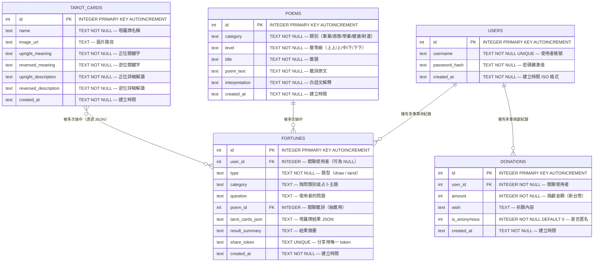

# 資料庫設計 — 線上算命系統

> **文件版本：** v1.0
> **建立日期：** 2026-04-16
> **對應文件：** [PRD.md](./PRD.md) ｜ [ARCHITECTURE.md](./ARCHITECTURE.md) ｜ [FLOWCHART.md](./FLOWCHART.md)

---

## 1. ER 圖（實體關係圖）



---

## 2. 資料表詳細說明

### 2.1 `users` — 使用者資料表

儲存系統的註冊使用者資訊。

| 欄位 | 型別 | 必填 | 說明 |
|------|------|------|------|
| `id` | INTEGER | ✅ | 主鍵，自動遞增 |
| `username` | TEXT | ✅ | 使用者帳號，不可重複 |
| `password_hash` | TEXT | ✅ | 經 werkzeug 雜湊後的密碼，禁止明文儲存 |
| `created_at` | TEXT | ✅ | 帳號建立時間（ISO 8601 格式） |

**索引：**
- `username` 欄位建立 UNIQUE 索引，加速登入查詢

---

### 2.2 `poems` — 籤詩資料表

儲存所有籤詩內容，屬於靜態參考資料，透過 `seed.sql` 初始化。

| 欄位 | 型別 | 必填 | 說明 |
|------|------|------|------|
| `id` | INTEGER | ✅ | 主鍵，自動遞增 |
| `category` | TEXT | ✅ | 籤詩適用類別：`事業`、`感情`、`學業`、`健康`、`財運` |
| `level` | TEXT | ✅ | 籤等級：`上上籤`、`上籤`、`中籤`、`下籤`、`下下籤` |
| `title` | TEXT | ✅ | 籤題名稱（如：「第一籤 — 龍飛九天」） |
| `poem_text` | TEXT | ✅ | 籤詩原文（古詩） |
| `interpretation` | TEXT | ✅ | 白話文解釋 |
| `created_at` | TEXT | ✅ | 資料建立時間 |

**備註：** PRD 要求至少 30 支籤詩，將在 `seed.sql` 中匯入。

---

### 2.3 `tarot_cards` — 塔羅牌資料表

儲存 22 張大阿爾克那塔羅牌資料，屬於靜態參考資料。

| 欄位 | 型別 | 必填 | 說明 |
|------|------|------|------|
| `id` | INTEGER | ✅ | 主鍵，自動遞增 |
| `name` | TEXT | ✅ | 塔羅牌名稱（如：「愚者 The Fool」） |
| `image_url` | TEXT | ❌ | 牌面圖片路徑（相對於 `static/images/`） |
| `upright_meaning` | TEXT | ✅ | 正位關鍵字（如：「新開始、冒險」） |
| `reversed_meaning` | TEXT | ✅ | 逆位關鍵字（如：「魯莽、猶豫」） |
| `upright_description` | TEXT | ✅ | 正位詳細解讀與建議 |
| `reversed_description` | TEXT | ✅ | 逆位詳細解讀與建議 |
| `created_at` | TEXT | ✅ | 資料建立時間 |

---

### 2.4 `fortunes` — 算命結果資料表

儲存每次抽籤或塔羅占卜的結果紀錄。

| 欄位 | 型別 | 必填 | 說明 |
|------|------|------|------|
| `id` | INTEGER | ✅ | 主鍵，自動遞增 |
| `user_id` | INTEGER | ❌ | 關聯 `users.id`，未登入時為 NULL |
| `type` | TEXT | ✅ | 算命類型：`draw`（抽籤）或 `tarot`（塔羅） |
| `category` | TEXT | ❌ | 詢問類別（抽籤）或占卜主題（塔羅） |
| `question` | TEXT | ❌ | 使用者輸入的問題 |
| `poem_id` | INTEGER | ❌ | 關聯 `poems.id`，僅抽籤時使用 |
| `tarot_cards_json` | TEXT | ❌ | 塔羅占卜結果的 JSON 字串，僅塔羅時使用 |
| `result_summary` | TEXT | ❌ | 結果摘要文字，用於歷史紀錄列表顯示 |
| `share_token` | TEXT | ❌ | 分享功能用的唯一識別碼（UUID），UNIQUE |
| `created_at` | TEXT | ✅ | 紀錄建立時間 |

**tarot_cards_json 格式範例：**
```json
[
  {"card_id": 1, "position": "past", "is_reversed": false},
  {"card_id": 7, "position": "present", "is_reversed": true},
  {"card_id": 15, "position": "future", "is_reversed": false}
]
```

**外部鍵：**
- `user_id` → `users(id)` ON DELETE SET NULL
- `poem_id` → `poems(id)` ON DELETE SET NULL

---

### 2.5 `donations` — 捐獻紀錄資料表

儲存使用者的捐獻（香油錢）紀錄。MVP 階段僅模擬捐獻流程。

| 欄位 | 型別 | 必填 | 說明 |
|------|------|------|------|
| `id` | INTEGER | ✅ | 主鍵，自動遞增 |
| `user_id` | INTEGER | ✅ | 關聯 `users.id`，捐獻必須登入 |
| `amount` | INTEGER | ✅ | 捐獻金額（新台幣，整數） |
| `wish` | TEXT | ❌ | 祈願內容（選填） |
| `is_anonymous` | INTEGER | ✅ | 是否匿名：0 = 具名，1 = 匿名 |
| `created_at` | TEXT | ✅ | 捐獻時間 |

**外部鍵：**
- `user_id` → `users(id)` ON DELETE CASCADE

---

## 3. 資料表關聯摘要

| 關聯 | 類型 | 說明 |
|------|------|------|
| `users` → `fortunes` | 一對多 | 一個使用者可有多筆算命紀錄 |
| `users` → `donations` | 一對多 | 一個使用者可有多筆捐獻紀錄 |
| `poems` → `fortunes` | 一對多 | 一支籤詩可被多次抽中 |
| `tarot_cards` → `fortunes` | 多對多（JSON） | 透過 `tarot_cards_json` 欄位儲存關聯 |

---

## 4. SQL 建表語法

完整的 SQL 建表語法請參閱 [`database/schema.sql`](../database/schema.sql)。

---

## 5. Python Model 程式碼

Model 檔案位於 `app/models/` 目錄下，每個資料表對應一個檔案：

| 檔案 | 對應資料表 | 說明 |
|------|-----------|------|
| `db.py` | — | 資料庫連線與初始化工具 |
| `user.py` | `users` | 使用者 CRUD（含密碼雜湊） |
| `poem.py` | `poems` | 籤詩查詢（隨機抽籤） |
| `tarot.py` | `tarot_cards` | 塔羅牌查詢（隨機抽牌） |
| `fortune.py` | `fortunes` | 算命結果 CRUD（含分享功能） |
| `donation.py` | `donations` | 捐獻紀錄 CRUD |

每個 Model 都包含以下標準方法：
- `create()` — 新增一筆紀錄
- `get_all()` — 取得所有紀錄
- `get_by_id(id)` — 依 ID 取得單筆紀錄
- `update(id, ...)` — 更新紀錄
- `delete(id)` — 刪除紀錄

---

> 📝 **下一步：** 資料庫設計確認後，請進入 **階段五：路由設計**，使用 `/api-design` skill 產出路由設計文件。
