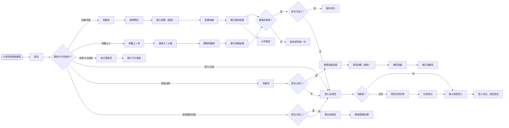
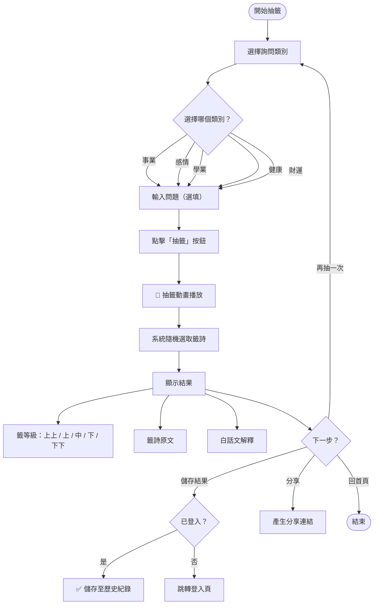
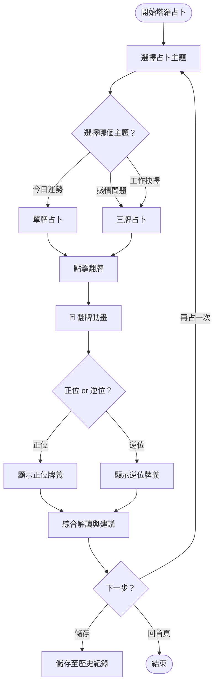
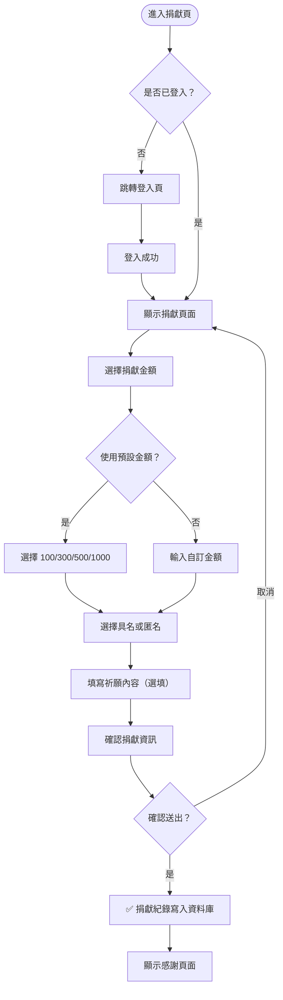
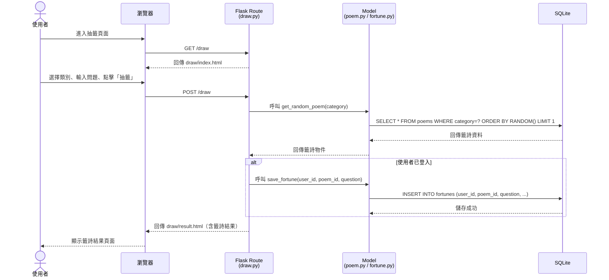
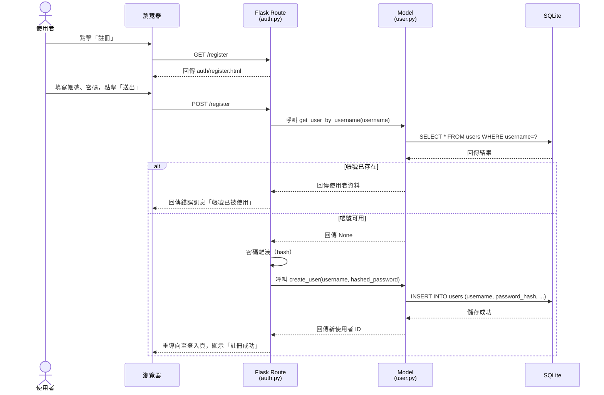
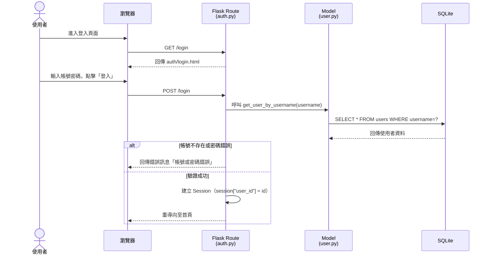
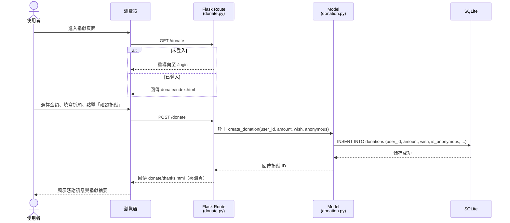
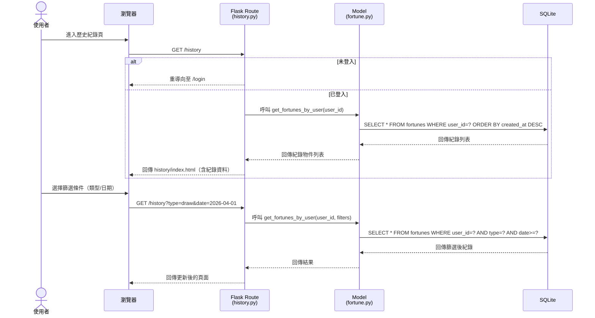

# 流程圖設計 — 線上算命系統

> **文件版本：** v1.0
> **建立日期：** 2026-04-09
> **對應文件：** [PRD.md](./PRD.md) ｜ [ARCHITECTURE.md](./ARCHITECTURE.md)

---

## 1. 使用者流程圖（User Flow）

### 1.1 整體操作流程

### 1.2 抽籤（求籤）詳細流程

### 1.3 塔羅占卜詳細流程

### 1.4 捐獻流程

---

## 2. 系統序列圖（Sequence Diagram）

### 2.1 抽籤（求籤）序列圖

### 2.2 使用者註冊序列圖

### 2.3 使用者登入序列圖

### 2.4 捐獻序列圖

### 2.5 歷史紀錄查詢序列圖

---

## 3. 功能清單對照表

| # | 功能 | URL 路徑 | HTTP 方法 | 說明 | 需登入 |
|---|------|---------|-----------|------|--------|
| 1 | 首頁 | `/` | GET | 顯示系統入口與功能選單 | ❌ |
| 2 | 註冊頁面 | `/register` | GET | 顯示註冊表單 | ❌ |
| 3 | 註冊處理 | `/register` | POST | 處理註冊請求 | ❌ |
| 4 | 登入頁面 | `/login` | GET | 顯示登入表單 | ❌ |
| 5 | 登入處理 | `/login` | POST | 處理登入請求 | ❌ |
| 6 | 登出 | `/logout` | GET | 清除登入狀態 | ✅ |
| 7 | 抽籤頁面 | `/draw` | GET | 顯示抽籤介面（選類別） | ❌ |
| 8 | 抽籤處理 | `/draw` | POST | 隨機抽籤並回傳結果 | ❌ |
| 9 | 籤詩結果 | `/draw/result/<id>` | GET | 顯示特定籤詩結果 | ❌ |
| 10 | 塔羅占卜頁面 | `/tarot` | GET | 顯示塔羅占卜介面 | ❌ |
| 11 | 塔羅占卜處理 | `/tarot` | POST | 隨機翻牌並回傳結果 | ❌ |
| 12 | 每日運勢 | `/fortune` | GET | 顯示今日運勢 | ❌ |
| 13 | 歷史紀錄 | `/history` | GET | 顯示算命歷史紀錄 | ✅ |
| 14 | 刪除紀錄 | `/history/delete/<id>` | POST | 刪除特定紀錄 | ✅ |
| 15 | 捐獻頁面 | `/donate` | GET | 顯示捐獻表單 | ✅ |
| 16 | 捐獻處理 | `/donate` | POST | 處理捐獻請求 | ✅ |
| 17 | 捐獻紀錄 | `/donate/history` | GET | 顯示捐獻紀錄 | ✅ |
| 18 | 個人中心 | `/profile` | GET | 顯示個人資訊與統計 | ✅ |
| 19 | 分享結果 | `/share/<id>` | GET | 公開的籤詩分享頁面 | ❌ |

---

> 📝 **下一步：** 流程圖確認後，請進入 **階段四：資料庫設計**，使用 `/db-design` skill 產出資料庫設計文件。
